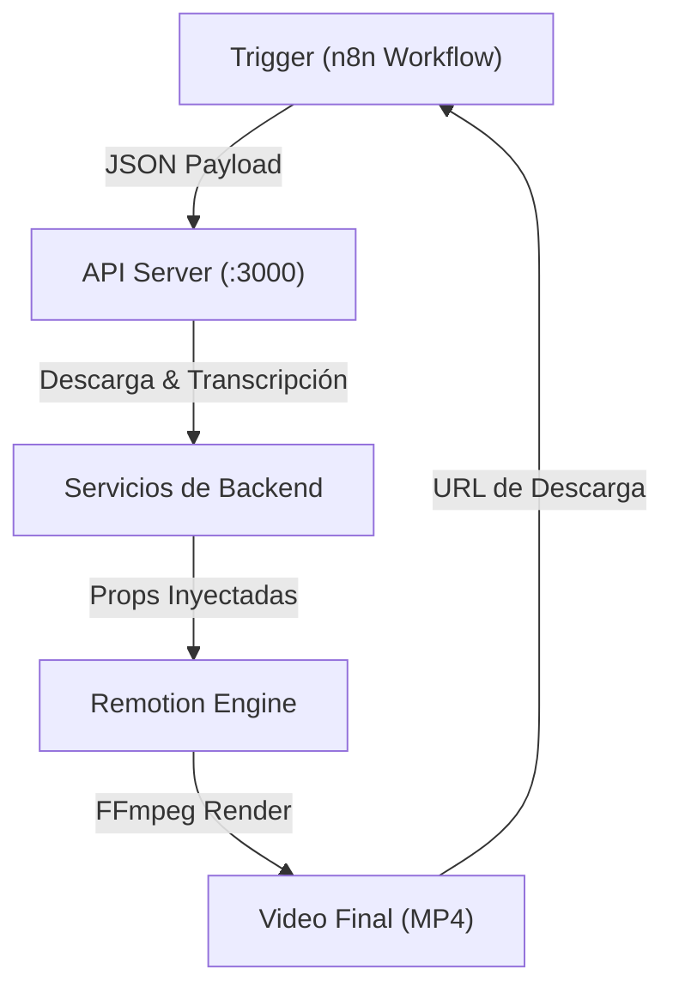

# 🏛️ Arquitectura del Proyecto (Monorepo)

Este proyecto ha sido estructurado como un **monorepo profesional** utilizando **NPM Workspaces**. Esta arquitectura permite desacoplar la lógica del servidor de la lógica de renderizado de video, facilitando el mantenimiento y la escalabilidad.

## Estructura de Folders

```text
fluent-stack-podcast/
├── apps/
│   ├── api/                # Servidor Express (Backend)
│   └── video/              # App de Remotion (Vite/React)
├── packages/
│   └── shared/             # Tipos y utilidades compartidas
├── docs/                   # Documentación detallada
├── package.json            # Configuración de Workspaces raíz
└── tsconfig.json           # Aliases globales de TypeScript
```

## Flujo de Datos y Señal

El sistema funciona como una tubería de procesamiento secuencial:



## Roles de los Espacios de Trabajo

### 1. `@fluent-stack/api` (apps/api)

Es el orquestador. Recibe peticiones de renderizado, descarga los archivos necesarios (audio e imágenes), genera transcripciones usando OpenAI o modelos locales, y finalmente dispara el comando de renderizado de Remotion.

### 2. `@fluent-stack/video` (apps/video)

Es la representación visual del podcast. Contiene las composiciones de React, los hooks de animación y los componentes de UI. Se ejecuta sobre Vite para previsualización instantánea (Remotion Studio).

### 3. `@fluent-stack/shared` (packages/shared)

Es el núcleo de tipos. Define interfaces como `RenderRequest`, `VocabularyItem` y `Captions`. Asegura que si cambias un campo en los datos, ambos mundos (API y Video) se actualicen y validen automáticamente.

## Comunicación entre Paquetes

- **Tipos**: Ambos apps importan tipos desde `@fluent-stack/shared`.
- **Renderizado**: La API dispara el renderizado apuntando al archivo `apps/video/src/Root.tsx`.
- **Paths**: Se utilizan aliases de TypeScript para resolver `@fluent-stack/shared` de forma transparente.
