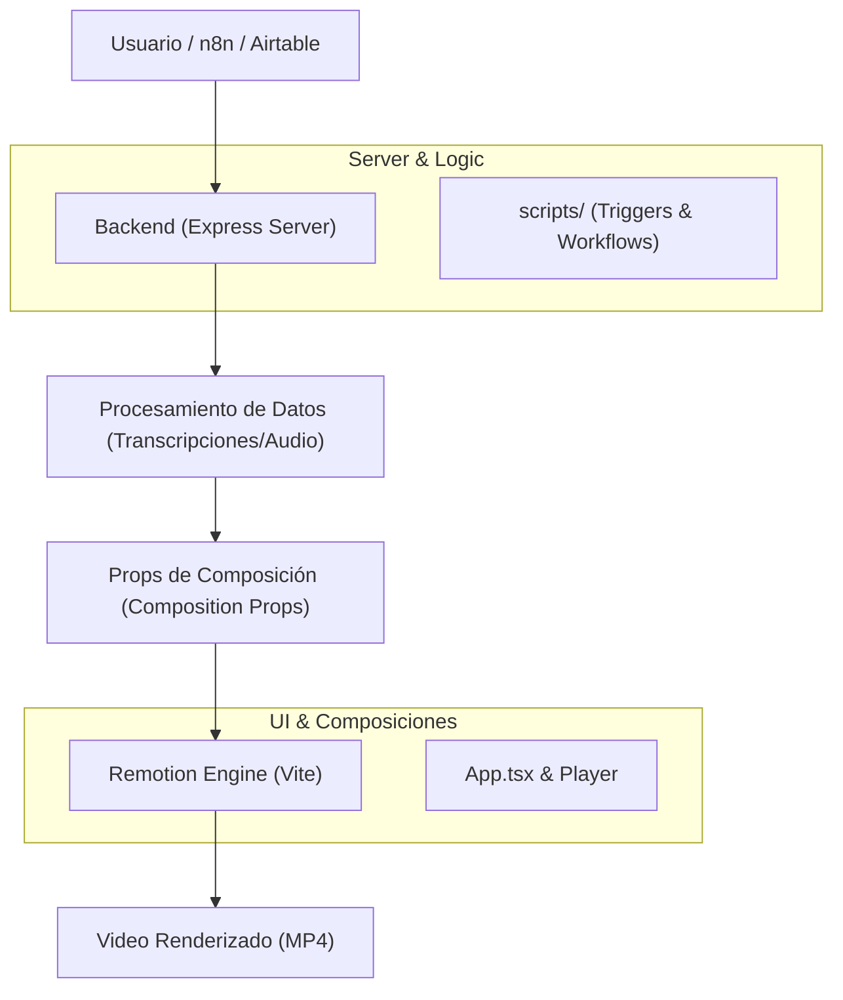

# Arquitectura del Proyecto

## Descripción General
Este proyecto es una plataforma de generación de video para podcasts ("Fluent Stack Podcast"). Utiliza un flujo de trabajo híbrido entre un servidor de procesamiento y un motor de renderizado basado en React (Remotion).

## Diagrama Conceptual (Simplificado)

## Módulos Principales

### 1. `server/` (Backend Logic)
- **Propósito**: Orquestar la creación de contenido, manejar integraciones externas (Airtable, n8n) y servir la API.
- **Acceso**: `npm run server`.

### 2. `src/` (Remotion & React)
- **`compositions/`**: Definición de las escenas de video (animaciones, layouts).
- **`components/`**: Elementos visuales reutilizables (barras de sonido, subtítulos).
- **`Root.tsx`**: El punto de entrada para Remotion que registra las composiciones.

### 3. `.agents/` (Inteligencia)
- Contiene el "cerebro" experto del asistente. Aquí residen las **Skills** que definen cómo se debe escribir código de Remotion, cómo manejar FFmpeg y cómo aplicar estilos premium.

### 4. `scripts/` (Automación)
- Herramientas auxiliares para tareas específicas, como disparar renders masivos o sincronizar datos.

## Flujo de Datos
1. El **Server** recibe o genera un objeto de datos (ej. transcripciones sincronizadas).
2. Los datos se pasan como **Props** a las composiciones de Remotion.
3. El **Remotion Player** (o el Renderer vía CLI) utiliza esos props para animar los elementos en el tiempo (basado en el FPS de la composición).
